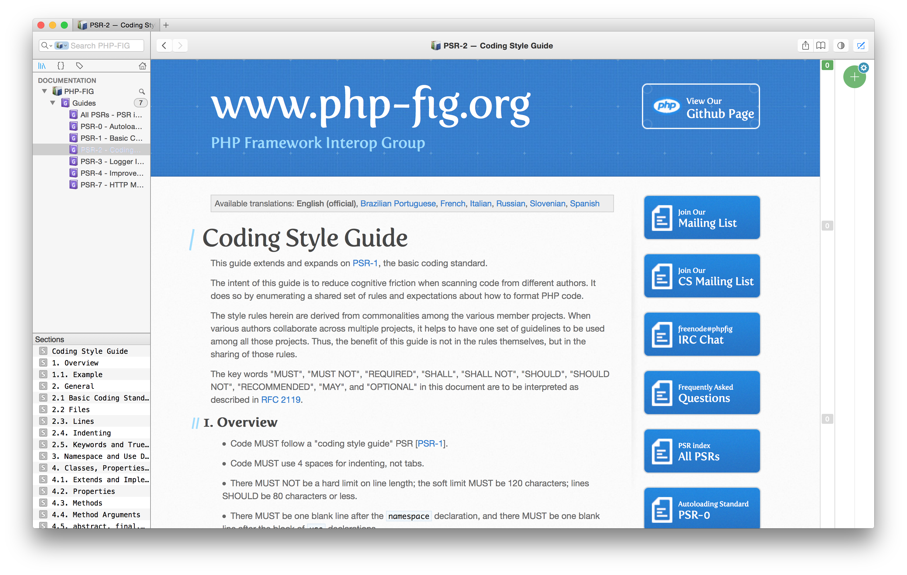

# dash-php-fig

dash-php-fig is a docset for [Dash.app][] containing the latest [PHP-FIG](http://www.php-fig.org).

## Installing

Install by opening Dash.app preferences, switch to `Downloads`, click `+`, and enter the feed URL
`https://raw.githubusercontent.com/pfefferle/dash-php-fig/master/PHP-FIG.xml`.

## Build

To rebuild or update this docset run the following commands in the following order:

1. `$ sh sync.sh` to grab the newest version of the specs
1. `$ python rebuild.py` to generate the docset from the grabbed sources
1. `$ sh pack.sh` to build the tgz file for a new release

## Changelog

### 1.0.0

* initial version

## Thanks

The [`sync.sh`][] and [`rebuild.py`][] scripts are based on [@willnorris][]' awesome [RFCDash Docset][] versions.

[Dash.app]: http://kapeli.com/dash
[open an issue]: https://github.com/pfefferle/dash-php-fig/issues
[`pack.sh`]: https://github.com/pfefferle/dash-php-fig/blob/master/pack.sh
[`sync.sh`]: https://github.com/pfefferle/dash-php-fig/blob/master/sync.sh
[`rebuild.py`]: https://github.com/pfefferle/dash-php-fig/blob/master/rebuild.py
[@willnorris]: https://willnorris.com
[RFCDash Docset]: https://github.com/willnorris/rfcdash
